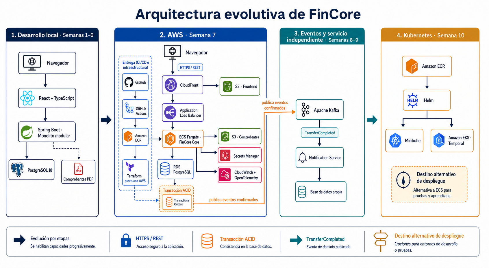

# FinCore

[](https://github.com/pieersx/fincore/actions/workflows/backend-ci.yml)
[](https://github.com/pieersx/fincore/actions/workflows/frontend-ci.yml)

FinCore es un simulador educativo de core financiero desarrollado para demostrar
ingeniería backend, arquitectura de software, testing, seguridad, DevOps y cloud.

El sistema comienza como un monolito organizado con **Feature + Layers** y evoluciona hacia
eventos, servicios independientes, AWS y Kubernetes.

> FinCore utiliza exclusivamente datos sintéticos y no procesa dinero real.



## Estado del proyecto

El backend funcional `v1.0.0` está implementado: identidad, clientes, cuentas,
beneficiarios, transferencias idempotentes, ledger de doble entrada, comprobantes
PDF, conciliación, auditoría y endpoints por rol. El frontend conserva su
*walking skeleton* y es el siguiente incremento; después se completará la etapa
DevOps y despliegue.

## Objetivo

Construir un producto financiero ficticio que permita demostrar:

- APIs REST con Java y Spring Boot.
- Organización por funcionalidades y capas técnicas claras.
- Transacciones financieras consistentes.
- Ledger inmutable de doble entrada.
- Idempotencia y control de concurrencia.
- Seguridad, autorización y auditoría.
- Pruebas automatizadas.
- CI/CD y seguridad de la cadena de suministro.
- Infraestructura reproducible en AWS.
- Observabilidad.
- Evolución justificada hacia eventos y microservicios.

## Funcionalidades implementadas en el backend v1.0.0

- Usuarios y roles.
- Clientes ficticios.
- Cuentas en PEN y USD.
- Beneficiarios.
- Transferencias internas.
- Historial de movimientos.
- Ledger de doble entrada.
- Comprobantes PDF.
- Auditoría.
- Paneles para cliente, analista y administrador.

Consulta el [alcance detallado](docs/PRODUCT_SCOPE.md) para conocer las reglas y
los límites de la primera versión.

## Arquitectura

La primera versión es una aplicación Spring Boot desplegable como una sola
unidad. Primero agrupa el código por funcionalidad y luego por capa:

```text
com.fincore
|-- identity/{controller,service,repository,entity,dto,mapper}
|-- customers/{controller,service,repository,entity,dto,mapper}
|-- accounts/{controller,service,repository,entity,dto,mapper}
|-- beneficiaries/{controller,service,repository,entity,dto,mapper}
|-- transfers/{controller,service,repository,entity,dto,mapper}
|-- ledger/{service,repository,entity,dto}
|-- audit/{controller,service,repository,entity,dto,mapper}
|-- onboarding/{controller,service,dto}
`-- shared/{config,dto,exception,model,security}
```

Esta organización evita los paquetes globales gigantes de controladores,
servicios y repositorios, y permite seguir una funcionalidad de extremo a extremo.

Los microservicios no se utilizarán hasta que exista una necesidad técnica
demostrable.

## Stack principal

| Área | Tecnologías |
| --- | --- |
| Backend | Java 21, Spring Boot 4.1, Feature + Layers y Maven |
| Persistencia | PostgreSQL 18, Spring Data JPA y Flyway |
| Seguridad | Spring Security 7.1, sesiones seguras, CSRF, BCrypt y RBAC |
| Frontend | React 19.2, TypeScript, Vite y Tailwind CSS |
| Pruebas actuales | JUnit, Spring MockMvc y Testcontainers |
| Frontend actual | React 19.2, TypeScript, Vite, Vitest y Tailwind CSS |
| DevOps actual | Docker Compose y GitHub Actions |
| Próximas etapas | UI completa, despliegue, observabilidad, AWS y seguridad CI |

Kafka y Kubernetes pertenecen a etapas posteriores; no son dependencias del
producto inicial.

## Evolución prevista

| Versión | Resultado |
| --- | --- |
| `v0.1.0` | Fundamentos del repositorio y arquitectura |
| `v0.2.0` | Walking skeleton |
| `v0.3.0` | Identidad y clientes |
| `v0.4.0` | Cuentas y ledger |
| `v0.5.0` | Transferencias |
| `v1.0.0` | Monolito Feature + Layers completo |
| `v1.1.0` | AWS y observabilidad |
| `v2.0.0` | Transactional outbox y Kafka |
| `v2.1.0` | Servicio de notificaciones |
| `v3.0.0` | Kubernetes |

## Documentación

- [Creación inicial con Vite y Spring Initializr](docs/BOOTSTRAP.md).
- [Guía para entender el backend](docs/BACKEND_GUIDE.md).
- [Contratos y ejemplos de la API](docs/API.md).
- [Plan de 10 semanas](docs/PROJECT_PLAN.md).
- [Alcance de v1.0.0](docs/PRODUCT_SCOPE.md).
- [Glosario del dominio](docs/DOMAIN_GLOSSARY.md).
- [Diagrama de arquitectura](docs/architecture/fincore-evolution.png).
- [Guía de contribución](CONTRIBUTING.md).

Las decisiones importantes se documentarán mediante Architecture Decision
Records dentro de `docs/adr`.

## Requisitos locales

- WSL2 con Linux.
- mise.
- Java 21.
- Maven 3.9.
- Node.js 24.
- pnpm 11.
- Docker y Docker Compose.
- Git.

Las versiones principales están fijadas en `mise.toml` y `package.json`.
La [guía de creación inicial](docs/BOOTSTRAP.md) explica qué archivos provinieron
de los generadores oficiales y qué personalizaciones se añadieron a FinCore.

## Ejecutar la aplicación local

Instala las herramientas y dependencias una vez:

```bash
mise install
pnpm install
```

Inicia PostgreSQL desde la raíz del repositorio:

```bash
docker compose up -d postgres
docker compose ps
```

Inicia el backend en una terminal:

```bash
SPRING_PROFILES_ACTIVE=local mise exec -- zsh -c 'cd backend && ./mvnw spring-boot:run'
```

Inicia el frontend en una segunda terminal:

```bash
pnpm dev:frontend
```

Con la aplicación iniciada, el endpoint de salud estará disponible en
`http://localhost:8080/actuator/health`.

Las pruebas crean una instancia desechable de PostgreSQL mediante Testcontainers.
La aplicación local utiliza el servicio definido en `compose.yaml` y aplica las
migraciones de Flyway durante el arranque.

Con el backend en ejecución, el frontend estará disponible en
`http://localhost:5173`. Vite redirige `/actuator` hacia Spring Boot durante el
desarrollo local.

Las cuentas y credenciales exclusivamente sintéticas para probar los roles se
encuentran en la [guía de la API](docs/API.md#cuentas-sintéticas-de-demostración).

Las verificaciones locales pueden ejecutarse sin iniciar manualmente PostgreSQL:

```bash
mise exec -- zsh -c 'cd backend && ./mvnw verify'
pnpm lint:frontend
pnpm test:frontend
pnpm build:frontend
```

Para detener los servicios locales sin eliminar los datos:

```bash
docker compose down
```

## Integración continua

Los workflows `Backend CI` y `Frontend CI` se ejecutan en cada Pull Request
dirigido a `main` y después de cada push a esa rama. El backend ejecuta
`./mvnw verify` con Java 21 y PostgreSQL mediante Testcontainers. El frontend
ejecuta lint, pruebas y build con Node.js 24 y pnpm.

## Seguridad

No deben guardarse en el repositorio:

- Datos personales, cuentas o transacciones reales.
- Contraseñas o tokens.
- Claves privadas.
- Credenciales de AWS.
- Archivos `.env` con secretos.
- Estado local de Terraform.

FinCore utiliza datos sintéticos y no está diseñado para procesar dinero real.

## Licencia

Este proyecto se distribuye bajo la [licencia MIT](LICENSE).

Copyright © 2026 pieersx.
