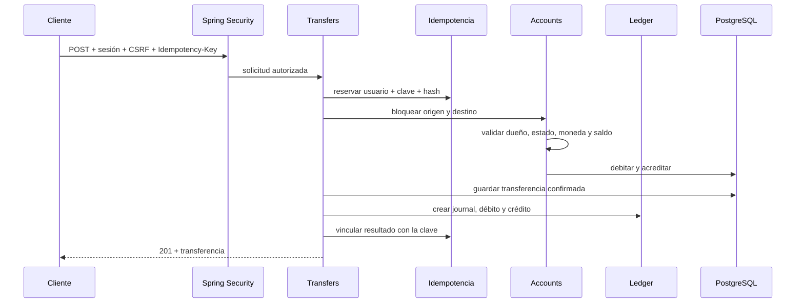

# Guía para entender el backend de FinCore

El backend `v1.0.0` es un monolito con estructura **Feature + Layers**.
Primero separa el código por funcionalidad y, dentro de cada feature, por capa
técnica. Esto permite entender un caso de uso completo sin
crear un único paquete global de controladores, servicios y repositorios.

## Estructura

```text
com.fincore
├── identity
├── customers
├── onboarding
├── accounts
├── beneficiaries
├── transfers
├── ledger
├── audit
└── shared
```

Cada feature contiene únicamente las capas que necesita:

```text
feature/
├── controller/   # HTTP, validación y códigos de respuesta
├── dto/          # solicitudes y respuestas sin detalles de JPA
├── entity/       # mapeo JPA, enums y comportamiento persistente
├── mapper/       # conversión explícita entre entity y dto
├── repository/   # acceso a PostgreSQL
├── service/      # casos de uso, reglas y transacciones
└── security/     # solo cuando la seguridad pertenece a esa feature
```

La dirección habitual es `controller -> service -> repository`. El controller
trabaja con DTO, el service aplica reglas y el repository persiste entidades.
Los mappers impiden devolver entidades JPA directamente por HTTP. Los contratos
de servicio permanecen en `service/`; no existe una convención especial para
tipos ubicados en la raíz de la feature.

## Responsabilidad de cada feature

| Feature | Es responsable de |
| --- | --- |
| `identity` | Usuarios, hashes BCrypt, roles, sesiones y reglas de acceso |
| `customers` | Perfiles sintéticos y estado operativo del cliente |
| `onboarding` | Alta atómica de identidad, cliente y cuentas PEN/USD |
| `accounts` | Cuentas, saldos, estados y bloqueo para transferir |
| `beneficiaries` | Cuentas destino autorizadas y borrado lógico |
| `transfers` | Orquestación, idempotencia, consultas y comprobante PDF |
| `ledger` | Journals y entries append-only de doble entrada |
| `audit` | Quién hizo qué, resultado y correlación |
| `shared` | Errores, paginación, moneda, reloj y filtros técnicos |

## Recorrido de una transferencia



`TransferExecutionService.execute` delimita una única transacción ACID. Si
falla una validación, una escritura o la comprobación contable, PostgreSQL
revierte saldos, transferencia, ledger e idempotencia.

## Concurrencia e idempotencia

`transfer_idempotency` tiene una restricción única por usuario y clave. El
repositorio intenta `INSERT ... ON CONFLICT DO NOTHING`:

- quien inserta adquiere la reserva y ejecuta el movimiento;
- un reintento con el mismo hash lee la transferencia original;
- un cuerpo diferente genera `409 Conflict`;
- dos solicitudes concurrentes esperan la decisión de PostgreSQL y no duplican
  el movimiento.

Las cuentas se leen con `PESSIMISTIC_WRITE` en orden estable de UUID. Así, dos
transferencias que compiten por el mismo saldo se serializan y se reduce el
riesgo de deadlock. `@Version` añade una segunda defensa contra escrituras
obsoletas.

## Ledger de doble entrada

Una transferencia genera:

- un `ledger_journal` con la referencia de negocio;
- un `ledger_entry` `DEBIT` para la cuenta origen;
- un `ledger_entry` `CREDIT` para la cuenta destino.

PostgreSQL aplica dos invariantes que no dependen solamente del código Java:

1. triggers que rechazan `UPDATE` y `DELETE` del ledger;
2. constraint triggers diferidos que exigen al menos dos entradas y totales de
   débito y crédito iguales al confirmar la transacción.

La conciliación reconstruye cada saldo con `créditos - débitos` y lo compara con
`financial_account.balance`. Esto permite detectar cualquier divergencia.

## Capas

### Controller

Define rutas, headers, Bean Validation, códigos HTTP y tipo de contenido. No
ejecuta SQL ni decide reglas financieras. Por ejemplo,
`TransferController` exige `Idempotency-Key`, CSRF y un monto con dos decimales.

### Service

Representa casos de uso. Usa `@Transactional` para escrituras y
`@Transactional(readOnly = true)` para consultas. Puede coordinar servicios de
otras features, pero nunca debe acceder directamente a sus repositorios.

### Repository

Spring Data JPA resuelve consultas de entidades. `JdbcClient` se usa cuando una
operación específica de PostgreSQL expresa mejor la intención, como el claim
atómico de idempotencia y la reconstrucción agregada de saldos.

### Entity

Mapea una tabla y protege comportamiento local. `FinancialAccount.debit`, por
ejemplo, comprueba estado y fondos antes de cambiar el saldo. Las entidades no
se devuelven por HTTP: los records `AccountView`, `TransferView` y otros DTO
evitan exponer detalles de JPA o campos sensibles.

## Seguridad

`SecurityConfiguration` mantiene una política cerrada por defecto:

- Swagger, Actuator, CSRF, login y registro tienen permisos explícitos;
- cliente, analista y administrador tienen rutas separadas;
- las escrituras requieren CSRF;
- la cookie de sesión es `HttpOnly` y `SameSite=Strict`;
- BCrypt costo 12 protege contraseñas;
- el perfil base usa cookie `Secure` y deshabilita registro público.

No se usa JWT porque el navegador y el monolito no necesitan distribuir la
autenticación entre servicios. Una sesión del lado servidor reduce la exposición
de credenciales en el frontend.

## Base de datos y migraciones

| Migración | Contenido |
| --- | --- |
| `V1` | Baseline y extensiones iniciales |
| `V2` | Usuarios, roles, clientes y auditoría |
| `V3` demo | Identidades exclusivamente sintéticas |
| `V4` | Cuentas, journals, entries y triggers contables |
| `V5` | Beneficiarios, transferencias e idempotencia |
| `V6` demo | Cuentas, saldos y movimientos sintéticos |

Las migraciones demo viven fuera de la ubicación base y solo se añaden con los
perfiles `local` y `test`. `hibernate.ddl-auto=validate` compara entidades y
tablas, pero nunca modifica el esquema.

## Pruebas

El backend tiene 25 pruebas automatizadas:

- arranque, Actuator, OpenAPI, configuración y seis migraciones;
- sesión, CSRF, roles, registro, suspensión y auditoría;
- cuentas propias, movimientos y beneficiarios;
- transferencia ACID e idempotencia repetida;
- dos solicitudes concurrentes con la misma clave;
- rollback por fondos insuficientes;
- conciliación y comprobante PDF.
- inmutabilidad de transferencias confirmadas y entradas contables en PostgreSQL.

El camino normal usa PostgreSQL 18.6 desechable con Testcontainers:

```bash
mise exec -- zsh -c 'cd backend && ./mvnw verify'
```

También se admite una base de pruebas externa para entornos donde el daemon de
Docker no es visible desde WSL:

```bash
export FINCORE_TEST_DB_URL='jdbc:postgresql://host:5432/fincore_test'
export FINCORE_TEST_DB_USERNAME='fincore'
export FINCORE_TEST_DB_PASSWORD='fincore_test'
mise exec -- zsh -c 'cd backend && ./mvnw verify'
```

En CI no se definen esas variables: Testcontainers crea y destruye PostgreSQL.

## Cómo estudiar el código

Para una funcionalidad concreta:

1. localiza la ruta en [`API.md`](API.md);
2. abre su clase en `controller`;
3. sigue la llamada a `service`;
4. identifica los servicios y DTO usados de otras funcionalidades;
5. revisa `entity` y `repository` de la feature propietaria;
6. busca las tablas y restricciones en Flyway;
7. lee la prueba que demuestra el comportamiento.

Este recorrido conecta HTTP, autorización, regla de negocio, transacción,
persistencia y evidencia automatizada.
